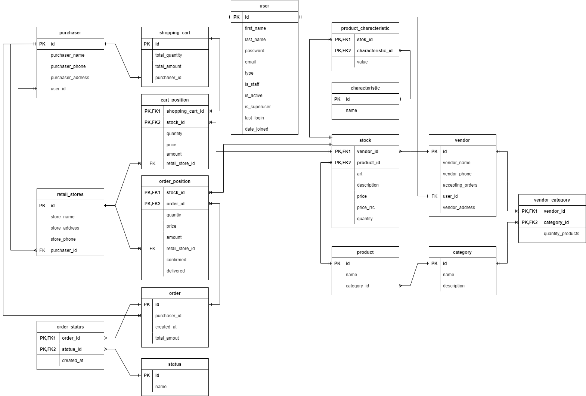

# API Сервис заказа товаров для розничных сетей.
### Бизнес модель:
### Задачи:
Приложение позволяет поставщикам размещать свои товары на площадке, а покупателям
осуществлять закупку товаров для своих розничных сетей.
### Принципы работы:
Каждый покупатель или продавец может создать пользователя внутри системы, при 
создании необходимо указать тип пользователя (продавец/покупатель).
Затем вам на почту придет электронное письмо с ссылкой для верификации.
А так же в приложении вы получите токены доступа.
##### Продавец:
Если вы выбрали тип: продавец, то для вас автоматически создастся профиль продавца и токен аутентификации.
Профиль необходимо будет дополнить личными данными, такими как наименование организации, адресом и т.д.
Далее продавец сможет создавать категории товаров, сами товары и характеристики товаров.
Затем продавец сможет создать позиции товаров на своем складе и определить для них модели,
характеристики и прочую необходимую информацию.
Так же после оформления заказа покупателем Вам на почту придет электронное письмо с просьбой
подтвердить позиции в заказе покупателя. После доставки вам необходимо обновить статус позиции заказа на 'доставлено'.
Вы так же можете воспользоваться страницей импорта товаров из файла yaml.
Вы можете остановить принятие заявок изменив в своем профиле возможность заказов.
Полностью удалить пользователя, его токен и все связанные сущности можно удалив сущность поставщика.
Все точки входа можно посмотреть ниже в разделе andpoint.

##### Покупатель:
Если вы выбрали тип: покупатель, то для вас автоматически создастся профиль покупателя и токен аутентификации.
Так же для вас создастся сущность корзины. 
Вам необходимо заполнить поля профиля с личной информацией, а так же создать для своего профиля ваши 
розничные магазины.
После этого вы сможете создавать позиции корзины, после чего сможете в сущности заказа 
разместить заказ из своей корзины.
Вы можете отменить свой заказ если позиции внутри него подтверждены или не доставлены.
Посмотреть статус заказа можно в самом заказе, статусы присваиваются автоматически при подтверждении
позиций заказа или установки статуса "доставдлено" для позиции поставщиком.
Удалить свой профиль вы можете из сущности поставщика, она автоматически удалит ваш токен
безопасности, вашу корзину, юзера и т.д. Будьте осторожны с этой функцией.
Все точки входа можно посмотреть ниже в разделе andpoint.

### Для запуска проекта необходимо:

- клонировать репозиторий:
```
git clone https://github.com/RMS83/graduation_project.git
```
- создайте приложение в соцсети VK и заполните поля соответветствующие поля default в settings.py:
```html
SOCIALACCOUNT_PROVIDERS = {
    'vk': {
        'APP': {
            'client_id': os.getenv('VK_CLIENT_ID', default=" "),
            'secret': os.getenv('VK_SECRET_KEY', default=" "),
            'key': ''
        }
    }
}
```
- установить все необходимые зависимости из requirements.txt
```
pip install -r requirements.txt
```
- создать базу данных order_app
```
createdb -U postgres order_app
```
- выполнить миграции
```
python manage.py makemigrations
python manage.py migrate
```
- импортировать сущности статусов заказов
```
python manage.py import_status
```
- создать суперпользователя:
```
python manage.py createsuperuser
```
- запустить проект:
```
python manage.py runserver
```

- для экспорта товаров доступна команда:
```
python manage.py export_products
```

- Примеры запросов к API представлены в файле requests-examples.http
- Пример файла для импорта товаров поставщиком import_products

##### Тестирование:
- Для тестирования приложения выполните команду
```
pytest
```

##### Троттлинг:
- Для пользователей API установлены ограничения по количеству запросов:
```html
'DEFAULT_THROTTLE_RATES': {
        'anon': '60/minute',
        'user': '360/minute'
    },
```

### Andpoint:
- Создание пользователя: http://127.0.0.1:8000/register/
- Просмотр изменение пользователя: http://127.0.0.1:8000/users/
- Вход пользователя в систему (login): http://127.0.0.1:8000/login/
- Обновление токена: http://127.0.0.1:8000/token/refresh/
- Залогиниться для работы через web: http://127.0.0.1:8000/api-auth/
- Поставщик: http://127.0.0.1:8000/api/v1/vendors/
- Категории товаров: http://127.0.0.1:8000/api/v1/categories/
- Категории у поставщика: http://127.0.0.1:8000/api/v1/vendor_categories/
- Продукты: http://127.0.0.1:8000/api/v1/products/
- Характеристики: http://127.0.0.1:8000/api/v1/characteristics/
- Продукт на складе поставщика: http://127.0.0.1:8000/api/v1/stocks/
- Характеристики продукта на складе поставщика: http://127.0.0.1:8000/api/v1/product_characteristics/
- Покупатель: http://127.0.0.1:8000/api/v1/purchasers/
- Магазины покупателя: http://127.0.0.1:8000/api/v1/retail_stores/
- Корзина покупателя: http://127.0.0.1:8000/api/v1/shopping_carts/
- Позиции корзины: http://127.0.0.1:8000/api/v1/cart_positions/
- Оформление заказа и заказы: http://127.0.0.1:8000/api/v1/orders/
- Позиции заказа: http://127.0.0.1:8000/api/v1/order_position/
- Статусы: http://127.0.0.1:8000/api/v1/status/
- Статусы заказов: http://127.0.0.1:8000/api/v1/order_status/
- Импорт товаров поставщиком: http://127.0.0.1:8000/import

### Схема модели базы данных:

